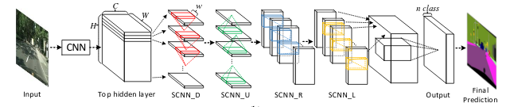

<!-- PROJECT SHIELDS -->
<!--
*** I'm using markdown "reference style" links for readability.
*** Reference links are enclosed in brackets [ ] instead of parentheses ( ).
*** See the bottom of this document for the declaration of the reference variables
*** for contributors-url, forks-url, etc. This is an optional, concise syntax you may use.
*** https://www.markdownguide.org/basic-syntax/#reference-style-links
Template from: https://github.com/othneildrew/Best-README-Template/blob/master/README.md
-->


# This is the repository for the Colab Version: Please refer to the updated repository for the GCP version by clicking the logo below:
* Colab version is different because mounting points for paths are different for Google Drive*

<!-- GCP LOGO -->
<br />
<p align="left">
  <a href="https://github.com/asharalam11/LaneNet/tree/gcp_vm">
    
  </a>
</p>

### *Colab version coming soon* :airplane:

# __Stanford CS231N Final Project (Spring 2020)__
# Lane Detection in Pytorch using Spatial CNN

SCNN is a lane detection algorithm, described in ['Spatial As Deep: Spatial CNN for Traffic Scene Understanding'](https://arxiv.org/abs/1712.06080). This is the [official implementation](<https://github.com/XingangPan/SCNN>).

This repository contains an implementation of this paper *with a modification of the backbone of model architecture in Pytorch 1.4.0*. This repository relies heavily on ['Pytorch implementation of SCNN'](https://github.com/harryhan618/SCNN_Pytorch).


## Dataset

<!-- TUSIMPLE LOGO -->
<br />
<p align="left">
    
</p>

### Tusimple
The dataset is available in [here](https://github.com/TuSimple/tusimple-benchmark/issues/3). Please download and unzip the files in one folder, which later can be organized in the following format:
```
dataset
├── clips
├── label_data_0313.json
├── label_data_0531.json
├── label_data_0601.json
└── test_label.json
```

We used the Tusimple dataset with ~4000 images with training (80%), validation (10%) and testing (10%) splits.

###### Since the pretrained models can't be uploaded on Github, you can download them from the links given below. Also, following is the organizational structure of folders you should follow in a GCP VM to make sure you do not have to make any changes to the absolute path in the code:

<br/>
:small_red_triangle_down::file_folder: Project
<br/>
  &ensp; &ensp; :small_red_triangle_down::file_folder: dataset
  <br/>
    &ensp; &ensp; &ensp; &ensp; :small_red_triangle_down::file_folder: clips
<br/>
    &ensp; &ensp; :small_red_triangle_down::file_folder: LaneNet (*this is the Github repo*)
<br/>
  &ensp; &ensp; :small_red_triangle_down::file_folder: pretrained
  <br/>
    &ensp; &ensp; &ensp; &ensp; :small_red_triangle_down::file_folder: baseline
  <br/>
    &ensp; &ensp; &ensp; &ensp; :small_red_triangle_down::file_folder: resnet18
  <br/>
    &ensp; &ensp; &ensp; &ensp; :small_red_triangle_down::file_folder: googlenet


## Trained Model Provided
:link:

* We modified the model architectures with different backbones to make the network less deeper and simpler while maintaining similar performance
* We have provided pretrained models we trained with several backbones, which can be downloaded from [here](https://drive.google.com/open?id=1Wv3r3dCYNBwJdKl_WPEfrEOt-XGaROKu).


* Following is the size of the models we used:

| Backbone | Model Size (Mbs)|
| -------- | --------------- |
| Baseline |      157        |
| ResNet18 |      52        |
| GoogleNet |     51        |
| ShuffleNet |      --        |
| MobileNet |      --        |
| ResNext |      --        |
| WideResNet |      --        |
| MNasNet |      --        |


#### Custom DataSet Preprocessing

We have provided a :orange_book:[```custom_dataset.ipynb```](data/custom_dataset.ipynb) notebook to perform any custom dataset splits and a :orange_book:[```visualize_lane.ipynb```](data/visualize_lane.ipynb) notebook to visualize the images

## Model

Our model is based on the SCNN paper by Pan et. al,  ['Spatial as Deep: Spatial CNN for Traffic Scene Understanding", AAAI2018](https://arxiv.org/abs/1712.06080), which builds on top of CNNs by doing slice-by-slice convolutions for message passing and recognizing continuous spatial information.
<br/>
<p align="left">
    
</p>
Specifically, we experimented with various vision models pretrained on ImageNet as the first CNN backbone before attaching it to the SCNN architecture as suggested in the paper. We further reduced the depth of the pretrained vision models and noticed that the performance of the network was similar with a reduction in size and complexity of the model.

We have provided a [```pretrained_model_lab.ipynb```](notebooks/pretrained_model_lab.ipynb) notebook to experiment with various vision models.


<!-- USAGE EXAMPLES -->
## Usage :arrow_forward:

<br/>

We have documented and explained the usage our code step-by-step (including Data Visualization, Training and Testing) in the :orange_book:[```LaneNet.ipynb```](notebooks/LaneNet.ipynb) notebook
_If you are facing any trouble understanding, please create an Issue or create a PR if you encounter a bug_

## Authors

* **Ashar Alam** [asharalam11](https://github.com/asharalam11)
* **Muhammad Aadil Khan** [aadil94](https://github.com/aadil94)

See also the list of [contributors](https://github.com/asharalam11/LaneNet/contributors) who participated in this project.

## Acknowledgement

* We would like to thank the teaching staff of [CS231N](http://cs231n.stanford.edu/) and all the students taking this course, who were very helpful in clearing out our doubts.
* This repos is build based on [Pytorch implementation of SCNN](https://github.com/harryhan618/SCNN_Pytorch) and [official implementation](<https://github.com/XingangPan/SCNN>).
